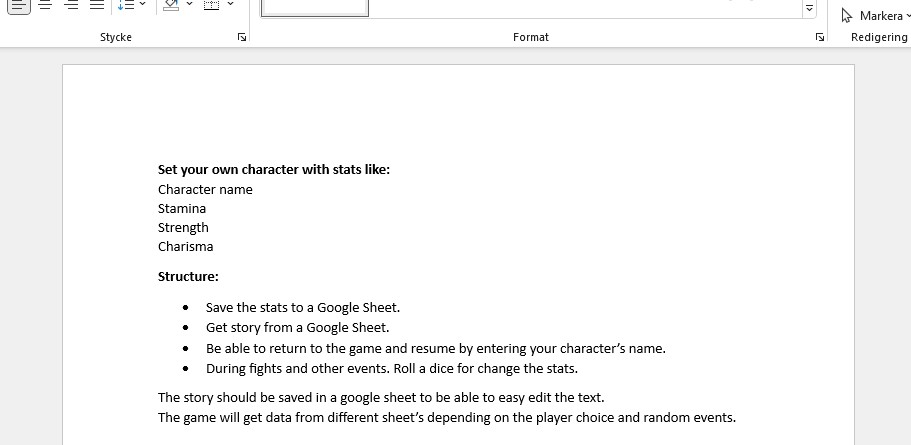
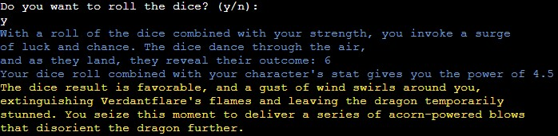
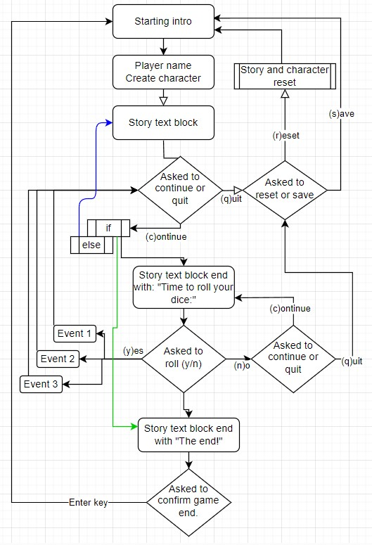
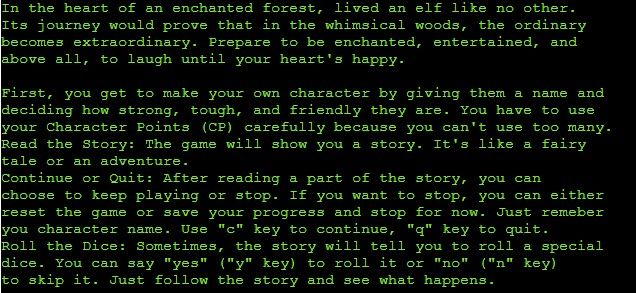
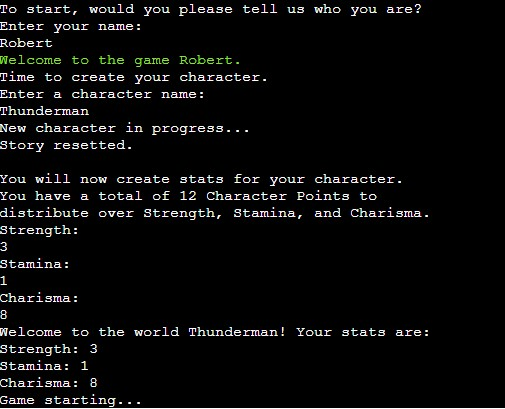
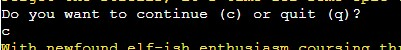
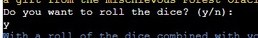
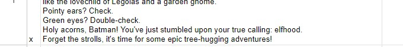
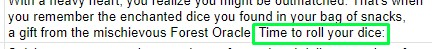
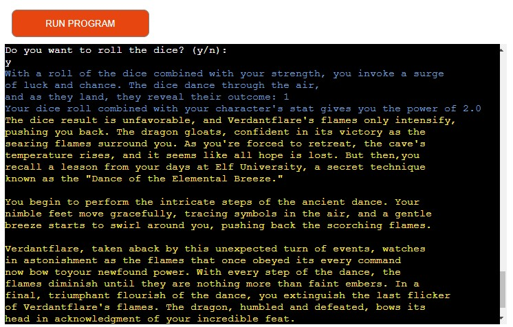

# <a id="the-game"></a>RPG - Text (console) based role-playing game.
<br>
## Third project at Code Institute

Welcome to a fantasy adventure.<br>
A role-playing text game.

# <a id="table-of-content"></a>Table of Content

- <a href="#the-game">RPG - Text (console) based role-playing game.</a>
- <a href="#table-of-content">Table of Content</a>
- <a href="#demo">Demo</a>
- <a href="#user-experience">User Experience</a>
- <a href="#user-stories">User Stories</a>
  - <a href="#strategy">Strategy</a>
  - <a href="#scope">Scope</a>
  - <a href="#structure">Structure</a>
  - <a href="#skeleton">Skeleton</a>
  - <a href="#surface">Surface</a>
- <a href="#technologies">Technologies</a>
    - <a href="#flowshart">Flowshart</a>
- <a href="#features">Features</a>
- <a href="#finalizing">Finalizing</a>
- <a href="#more-features">More Features</a>
- <a href="#testing">Testing</a>
  - <a href="#validating">Validating</a> 
  - <a href="#bugs">Bugs</a>
- <a href="#deployment">Deployment</a>
- <a href="#credits">Credits</a>
  - <a href="#acknowledgments">Acknowledgments</a>

# <a id="demo"></a>Demo

The live link to Heroku can be found here - <a href="https://rpg-p3-40e9a3ed28c2.herokuapp.com/" target="_blank">https://rpg-p3-40e9a3ed28c2.herokuapp.com/</a>

The idea for this project it to make a playable textbased role-playing game with a really humorous twist. I kind of had a story in my head, but to save time on writing text, I used ChatGPT to generate the text. I've edited some to make it fit more to the game play.

# <a id="user-experience"></a>User Experience

I wanted the user (player) to get a good experience even though it is only a text based game.<br>
What can be done with text? Colors? Ascii art? Yes I used it.

## <a id="user-stories"></a>User stories

A player should:

- Be able to create a character, that will be saved.
- Easily understand the game commands.
- Play a game for fun.
- Have at least one good laugh.

### <a id="strategy"></a>Strategy

I aimed for a text based role-playing game where a player should be able to create and name a character with some simple stats. The characters stats combined with dice rolls would determine the outcome. For example: If the character has more strength it will be able to fight the dragon. If it has more charisma it will be more "lucky with partners". Even if the main story will end up the same, there will be three different side events from every time the dice rolls.
The story should be able to be edited easily in a Google Sheet. That will act as a database for the story, dice roll events and saving player and character.

### <a id="scope"></a>Scope

This will show what I learnt in the Python programming module.<br>
I had to choose not to include many of my ideas. Some examples can be found in the More feature list.

### <a id="structure"></a>Structure

- The structure is really simple. A python run file to contain the code.
- Linked to a Google Sheet through an API to get and save data.


### <a id="skeleton"></a>Skeleton

There is not much of a skeleton to mention here. All the code is in the run python file. Credentials for the API in another file that is put is set to the .gitignore so the credentials will not be visible.

**Wireframe**

When starting this project I tried to get my ideas in to a word document.<br>


### <a id="surface"></a>Surface

What is possible to do with a text based game?
I wanted the player to experience some visual features that will happen for different event.
- First I added some ascii art. There is a dragon.
- Second, I wanted the story text to stand out from the "console text" so I found a way to colorize the text. The story text as yellow and dice rolls as blue text. 


## <a id="technologies"></a>Technologies

1. Python - to create functions for the game.
2. Google Sheet API - To connect to a Google Sheet.
3. Google Sheet - for storing the text.

## <a id="flowshart"></a>Flowshart

<br>
<details>
    <summary>Explaining the flowshart</summary>
    <ul>
    <li>Game start with a short preface for the game and also explaining some game commands.</li>
    <li>Player enter their name and create a simple character.</li>
    <li>Role-playing game start to get a story block from a Google Sheet.</li>
    <li>After each text block the player is asked to continue.</li>
    <li>The text block is checked for two different ending phrases</li>
    <li>If a text block ends with the phase "Time to roll your dice" the player will be asked to roll</li>
    <li>From each of the dice roll event there will be three different scenarios. Then a player is asked continue.</li>
    <li>The game continue to the main story efter the scenario from the dice roll event.</li>
    <li>If a text block end whith the phrase "The end!" that will trigger the ending sequense where player is asked to confirm game end.</li>
    <li>Game will reboot.</li>
</details>

## <a id="features"></a>Features

### Existing Features

Game starting:
The game starts with a preface and explain how to play the game.<br>
<br>


The player will have to be able to use a keyboard to type letters to operate the game.<br>
First of all to enter a name, and then create a character with name and stats.<br>
<br>

Through the game it will ask if the player would like to continue or quit using the keys "c" respectively "q".<br>
<br>

The game will also ask if the player would like to roll the dice by typing letters "y" or "n".<br>
<br>

### Google Sheet

The game use a Google Sheet as a database. This to easily edit the text of the story. There is one sheet for the main story, one sheet for events from the roll dice, and one sheet for the player and character data.

### Game play mechanics

There is one main story in the Google Sheet document.
Each section of the game has its on row in the sheet.
Each line in the sheet will be checked if it's been used. If not, it will be printed and marked with "x" to be able to continue.
The length of the sentences are set to mach the width of the Heroku console. Just so that the row brake doesn't happen within a word. Also the text block are small enough to fit within the console windows to prevent the need of scrolling to read the text.<br>
<br>
To mark the row with "x" also gives the benefits to manually set or remove an "x" in the sheet. For example to be able to run a specific text block over and over again in the console while testing.<br>

If the text in the story ends with "Time to roll your dice:" it will trigger next roll dice event.<br>
<br>

Error handling

The game has error handling to:

- Check the API connection to Google Sheet.
- Check that "rpg_p3" Google Sheet exists.
- Restrict the player name only to alphabetical letters and max 20 character long.
- Restrict the character name only to alphabetical letters and max 20 character long.
- Set the total value of character stats to 12.
- Make sure the player only enter numbers for stats.

## <a id="finalizing"></a>Finalizing

A screenshot form the game running in Heroku console.<br>
<br>


## <a id ="more-features"></a>More Features?

Is there more to add to the game?<br>
It feels like this game can be expanded to endless.

- Option to go for different storylines.
- Feature to be able to answer the riddles.
- Different events can upgrade the character stats.
- Create a graphic interface.


## <a id="testing"></a>Testing

Through the developing of the game I made sure I had something to run in the console. So whenever I made och changed something, I tested it. So continuesly testing the game has been important.

I started to struggle a bit with updating cells in google sheet.
I wanted the cells to update with one row of data:<br>
     ```character_data = [player_name, char_name, char_str, char_sta, char_cha] ```<br>
     ```player_sheet.update("A2:E2", [character_data]) ```
     <br>
Event though it works, the terminal gives me the following warning:<br>
    " ```/home/codeany/.local/lib/python3.8/site-packages/gspread/worksheet.py:1069: UserWarning: [Deprecated][in version 6.0.0]: method signature will change to: 'Worksheet.update(value = [[]], range_name=)' arguments 'range_name' and 'values' will swap, values will be mandatory of type: 'list(list(...))'
  warnings.warn(" ```

So I changed it to update each cell individually. Not pretty, I know, but couldn't find a way to get the prevoius line of code working without a warning.<br>
     ```player_sheet.update_acell('A2', player_name)```<br>
     ```player_sheet.update_acell('B2', char_name)```<br>
     ```player_sheet.update_acell('C2', char_str)```<br>
     ```player_sheet.update_acell('D2', char_sta)```<br>
     ```player_sheet.update_acell('E2', char_cha)```<br>

I also encountered this:<br>
    ```gspread.exceptions.APIError: {'code': 429, 'message': "Quota exceeded for quota metric 'Read requests' and limit 'Read requests per minute per user' of service 'sheets.googleapis.com' for consumer...```<br>
I'm guessing I can't access the google sheet when testing and just hitting continue over and over too fast.

When trying showing the game to my mentor, we discovered that we couln't have the Heroku terminal open at the same time. One had to close it.

### <a id="validating"></a>Validating

I googled for any PEP8 and Python code validators, but could not find anyone working. I think I tried like five or six different. Some just threw errors on the API credentials and some didn't work at all. After spending some time to find a validator that worked I gave up. I relying on my telling me that it looked nice.

### <a id="bugs"></a>Bugs?

I haven't really encountered any bugs in this project.<br>
I got stuck several times in order to figure out different things but that is all about learning.

## <a id="deployment"></a>Deployment

The site was deployed to Heroku. Using the Code institute guidence from Love Sandwiches walkthrough.

- I used the GitHub template to create my own repository.
- Used Codeanywhere as IDE.
- Made a Google sheet and set up the API according to the videos in the Love Sandwiches walkthrough.
- I deployed the project to Heroku going through these steps.
    1. Create new app.
    2. Named it: rpg-p3 (Short for Role Playing Game - Project 3).
    3. Choose Europe as region.
    4. I went to the Settings tab to create config vars for CREDS and PORT.
    5. I added the buildpacks Python and Nodejs.
    6. In the Deploy tab I connected to GitHub repository "rpg-p3".
    7. I manually deployed branch (main).

## <a id="credits"></a>Credits


- Google search engine is frequently used. It's hard to remember how to write codes.
- A lot of help comes from search hits at the "stack overflow" forums.
- The game story written by ChatGPT with my instructions of a fantasy story including hilarious adventures of an elf and a dragon.
- Adobe Photoshop to edit the dragon-elf image for this readme.
- Using <a href="https://www.online-spellcheck.com/" target="_blank">https://www.online-spellcheck.com/</a> for spelling.


### <a id="acknowledgments"></a>Acknowledgments

- Thanks David Calikes for jumping in on short notice to take a meeting when mentor was not available. And thanks for several pieces of advice.