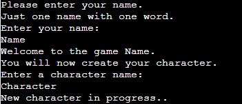
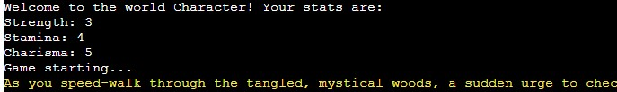

# <a id="the-game"></a>RPG - Text (console) based role playing game.
<br>
## Second project at Code Institute

Text

# <a id="table-of-content"></a>Table of Content

- <a href="#the-game">RPG - Text (console) based role playing game.</a>
- <a href="#table-of-content">Table of Content</a>
- <a href="#demo">Demo</a>
- <a href="#user-experience">User Experience</a>
- <a href="#user-stories">User Stories</a>
  - <a href="#strategy">Strategy</a>
  - <a href="#scope">Scope</a>
  - <a href="#structure">Structure</a>
  - <a href="#skeleton">Skeleton</a>
  - <a href="#surface">Surface</a>
- <a href="#technologies">Technologies</a>
- <a href="#features">Features</a>
- <a href="#finalising">Finalising</a>
- <a href="#more-features">More Features</a>
- <a href="#testing">Testing</a>
  - <a href="#bugs">Bugs</a>
- <a href="#deployment">Deployment</a>
- <a href="#credits">Credits</a>
  - <a href="#acknowledgements">Acknowledgements</a>

# <a id="demo"></a>Demo

The live link to Heroku can be found here - <a href="https://rpg-p3-40e9a3ed28c2.herokuapp.com/" target="_blank">https://rpg-p3-40e9a3ed28c2.herokuapp.com/</a>

The idea for this project it to make a playable textbased role playing game with a really humorous twist. I kind of had a story in my head, but to save time on writing text, I used ChatGPT to generate the text. I've edited some to make it fit more to the game play.

# <a id="user-experience"></a>User Experience

I wanted the user (player) to get a good experience even though it is only a text based game. 

## <a id="user-stories"></a>User stories

A player should:

- Be able to create a character.
- Be able to save the character.
- Easily understand the came commands.
- Play a game for fun.
- Have at least one good laugh.

### <a id="strategy"></a>Strategy

I aimed for a text based role playing game where a player should be able to create and name a character with some simple stats. The characters stats combined with dice rolls would determen the outcome. For example: If the character has more strength it will be able to fight the dragon. If it has more charisma it will be more "lucky with partners". Even if the main story is one there will be three different side events from every time the dice rolls.
The story should be able to be editied easily in a Google Sheet. That will act as a database for the storyline, dice roll events and saving player and character.

### <a id="scope"></a>Scope

This will show what I learnt in the Python programming module. And also add something different like thinking outside the box with the possibility to enter cheat code.

### <a id="structure"></a>Structure

- The structure is really simple. A python run file to contain the code.
- Link to a Google Sheet to get and save data.


### <a id="skeleton"></a>Skeleton

There is not much of a skeleton to mension here. All the code is in the run python file. Credentials for the API in another file that is put is set to the .gitignore so the credentials will not be visible.

**Wireframe**

When starting this project I tried to get my ideas in to a word document.<br>


### <a id="surface"></a>Surface

What is possible to do with a text based game?
I wanted the player to experince some visual features that will happen for different event.
- First I added some ascii art. I used a dragon.
- Second, I wanted the story text to stand out from the "console happenings" so I found a way to colorize the text. The story text as yellow and dice rolls as blue text. 


## <a id="technologies"></a>Technologies

1. Python - to create functions for the game.
2. Google Sheet API - To connect to a Google Sheet.
3. Google Sheet - for storing the text.

## <a id="features"></a>Features

Existing Features

The player will havt to be able to use a keyboard. To type letters to operate the game.
First of all to enter a name, and then create a character with name and stats.<br>
<br>


Through the game it will ask if the player would like to continue or quit using the keys "c" respectively "q"
The game will also ask if the player would like to roll the dice by typing letters "y" or "n".

Google Sheet

The game use a Google Sheet as a database. This to easily edit the text of the story. There is one sheet for the main story, one sheet for events from the roll dice, and one sheet for the player and character data.

Error handling

The game has error handling to:
<ul>
<li>Check the API connection to Google Sheet.</li>
<li>Check that "rpg_p3" Google Sheet exists. </li>
<li>Rerstrict the player name only to </li>
<li></li>
<li></li>
<li></li>
<li></li>
</ul>

## <a id="finalising"></a>Finalising

<br>
<br>
I've been using the responsive layout a lot in inspect mode using Google Chrome.

## <a id ="more-features"></a>More Features?

Is there more to add to the game?
<ul>
<li> The ability to go to next level if you win a round of ten points. Just for fun. The game can't be "harder" on a higher level. :-D</li>
<li> Adding more codes for different features.</li>
</ul>

## <a id="testing"></a>Testing

I started to stuggle a bit with updating cells in google sheet.
I wanted the cells to update with one row of data:<br>
     ```character_data = [player_name, char_name, char_str, char_sta, char_cha] ```<br>
     ```player_sheet.update("A2:E2", [character_data]) ```

Event though it works the terminal gives me the following warning:<br>
    " ```/home/codeany/.local/lib/python3.8/site-packages/gspread/worksheet.py:1069: UserWarning: [Deprecated][in version 6.0.0]: method signature will change to: 'Worksheet.update(value = [[]], range_name=)' arguments 'range_name' and 'values' will swap, values will be mandatory of type: 'list(list(...))'
  warnings.warn(" ```

So I changed it to update each cell individually. Not pretty, I know, but couldn't find a way to get it working without a warning.<br>
     ```player_sheet.update_acell('A2', player_name)```<br>
     ```player_sheet.update_acell('B2', char_name)```<br>
     ```player_sheet.update_acell('C2', char_str)```<br>
     ```player_sheet.update_acell('D2', char_sta)```<br>
     ```player_sheet.update_acell('E2', char_cha)```<br>

In contrast to the first project. I continuously tested the code along to with coding to make sure everything is ok.

Some things that come up is to add a header to each section in the html code. But I later changed the sections and just had one header added.

The CSS Validator gave me two errors. One that I had forgot to write a unit on a margin. And the second one was that I had typed "position; bottom;"
which I changed to "position; fixed;".

I also used Lighthouse in Chrome to find ways to increase the accessibility of the website.<br>

Links to the validation
<ul>
<li> HTML of <a href="https://validator.w3.org/nu/?doc=https%3A%2F%2Frobertahlin.github.io%2Frps-project2b%2Findex.html" target="_blank">index</a> page.</li>
<li> HTML of <a href="https://validator.w3.org/nu/?doc=https%3A%2F%2Frobertahlin.github.io%2Frps-project2b%2Fgame.html" target="_blank">game</a> page.</li>
<li> CSS of <a href="https://jigsaw.w3.org/css-validator/validator?uri=https%3A%2F%2Frobertahlin.github.io%2Frps-project2b%2Fassets%2Fcss%2Fstyle.css&profile=css3svg&usermedium=all&warning=1&vextwarning=&lang=en" target="_blank">style.css</a>.</li>
<li> To validate my JavaScript I  used <a href="https://jshint.com/" target="_blank">https://jshint.com/</a>. (Couldn't find a way to post links, directly to the JavaScript file.)</li>
</ul>

Other than the validators. I've been using the Inspect view in Google Crome using different layout for different devices and a lot with the responsive layout.
I also tested the website through my iPhone.
I've tested the website on a PC using Chrome and Edge web browsers.
Also, my mentor has tried the website.

### <a id="bugs"></a>Bugs?

<ul>
<li>There is something with the "swap image function" when clicking the "Reset scores" button. Sometimes it doesn't swap to the "down button image". After hard refreshing the page a couple of times it works. Sometimes it works when holding down the mouse button for a while. It also seems to work better in Microsoft Edge.</li>
<li>Also the swap image function doesn't seem to respond when in inspect mode in Google Chrome.
<li>The toggle of div containing the instructions on the index page don't work when the script is in the script.js file. I had to place it in another file called index-script.js. I discovered that if I placed it first in the script.js document it worked, but then the swap image effect on the "Reset Score" button stopped working completely. I couldn't figure out why. So the solutions was to have them in different files.</li>
</ul>

## <a id="deployment"></a>Deployment


The site was deployed to Heroku. Using the Code institute guidence from Love Sandwiches walkthrough.
<ul>
<li>I used the GitHub template to create my own repository.</li>
<li>Used Codeanywhere as IDE.</li>
<li>Made a Google sheet and set up the API acording to the videos in the Love Sandwiches walkthrough.</li>
<li>I deployed the project to Heroku goint through these steps.</li>
    <ol>
    <li>Create new app</li>
    <li>Named it: rpg-p3 (Short for Role Playing Game - Project 3)</li>
    <li>Choosed Europe as region</li>
    <li>I went to the Settings tab to create config vars for CREDS and PORT</li>
    <li>I added the buildpacks Python and Nodejs</li>
    <li>In the Deploy tab I connected to GitHub repository "rpg-p3"</li>
    <li>I manually deployed branch (main)</li>
    <li></li>
    <li></li>
    </ol>
</ul>


## <a id="credits"></a>Credits

<ul>
<li>For this project I want to credit the Google search engine. It's hard to remember how to write all codes.</li>
<li>A lot of help comes from search hits at the "stack overflow" forums.</li>
<li>The game story written by ChatGPT with my instructions of a fantasy story including hilarious adventures of an elf and a dragon.
</ul>

### <a id="acknowledgements"></a>Acknowledgements

- Thanks David Calikes for jumping in on short notice to take a meeting when mentor was not available. And thank you for valuable advices.